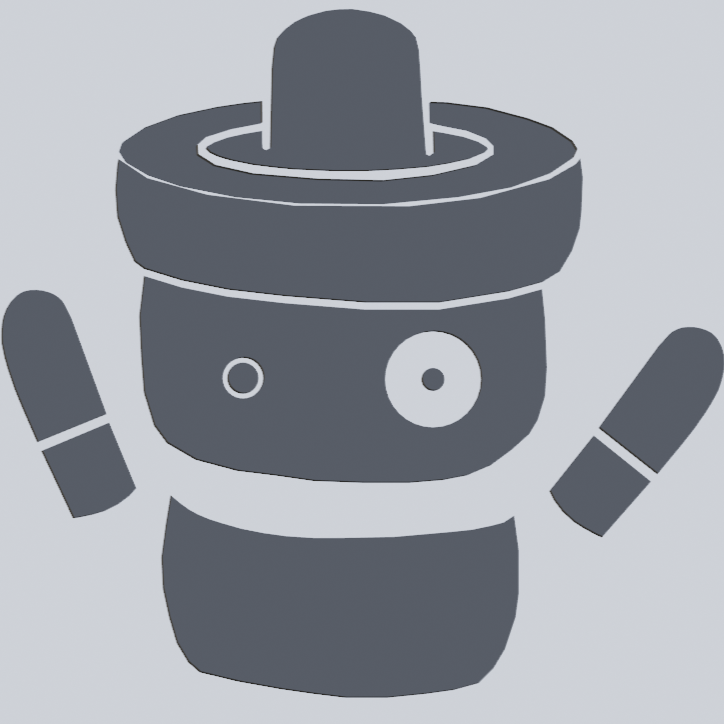
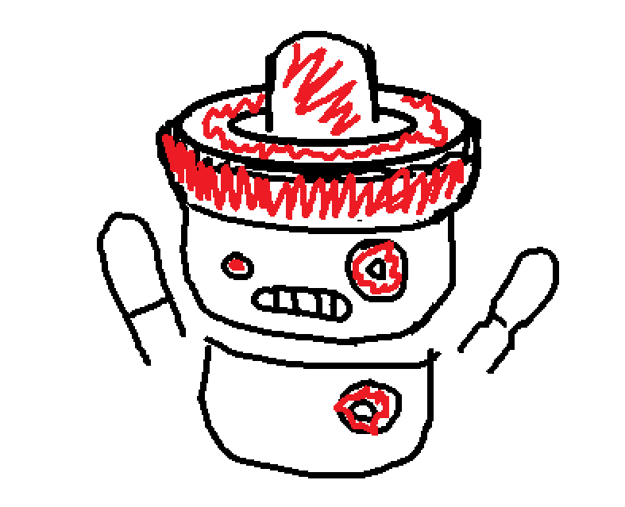
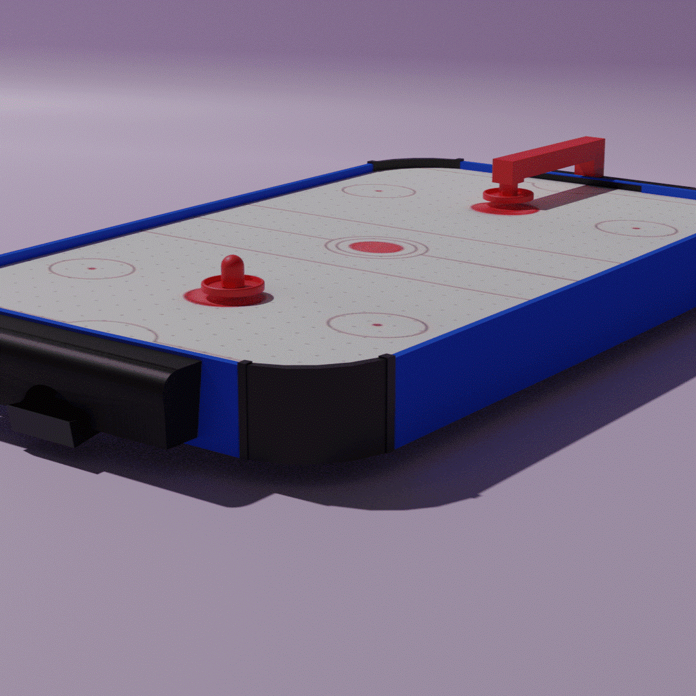
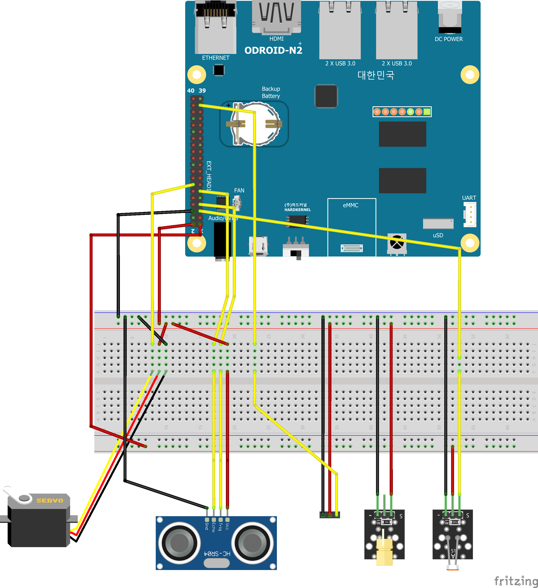
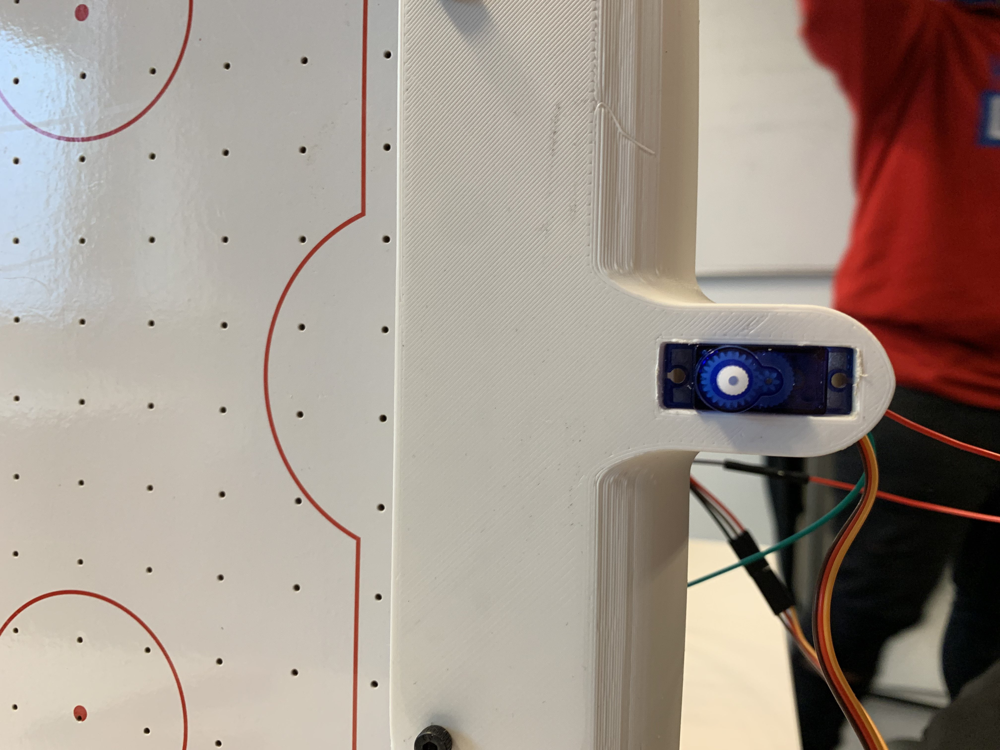
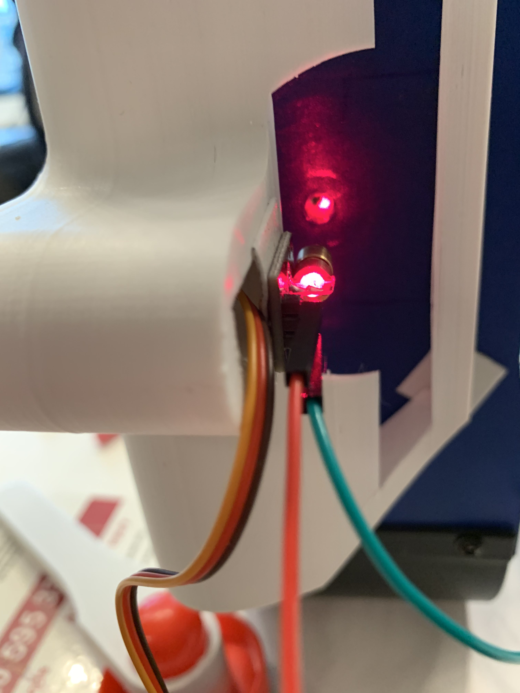
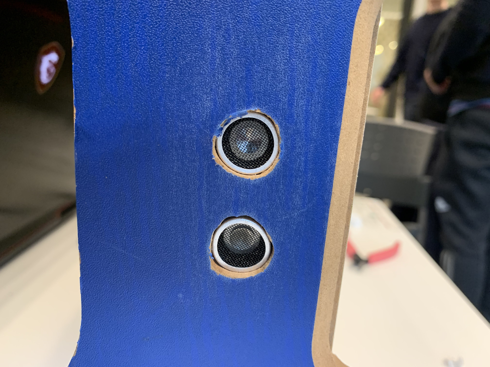

# Fasten your seatbelts





## Introductie 


## Concept logo

Dit was ons eerste logo Idee: een robot met een airhockey pusher op zijn hoofd. We hebben ook een naam bedacht: Rob! Dat is een afkorting van ROBot. We zijn dit logo daarna gaan uitwerken en uiteindelijk is het ons uiteindelijke logo geworden:

## Inleiding

In deze git vind je alles wat nodig is om ons idee voor een airhockey tafel na te maken. Dit project is een onderdeel van de studie Techtnische Informatica op de HVA. Dit project is gemaakt door de volgende eerste jaars TI studenten: Koen Lammers, Melvin Moes, Jayden van Oorschot, Simon Zweers, Nick schokker en Jurrien Simmons.

## Inhoudsopgave

- [Beschrijving](#beschrijving)
- [Business case](#busines-case)
- [Benodigdheden](#benodigdheden)
- [Beeldmateriaal](#beeldmateriaal)
- [Installatie](#installatie)
- [Functies](#functies)
    - [Countdown](#countdown)
    - [Soundsensor](#soundsensor)
    - [Servo](#servo)
    - [LDR](#ldr)
    - [Ultrasonic](#ultrasonic)
    - [Score weergeven op website](#score-weergave-op-de-website)
- [Threading](#threading)
- [Database](#documentatie-database)
    - [MySQL installeren](#mysql-installatie)
    - [Database Connectie](#database-connectie)
    - [Database Query's](#database-query)
- [Support](#support)
- [Ontwikkelaars](#ontwikkelaars)
- [Bronnen](#bronnen)

## Beschrijving

Het doel van het project is om een airhockey tafel te maken die werkt met maar 1 deelnemer. Je kan dan spelen tegen een automatische tegenstander die de puck terug zal kaatsen. De benodigdheden kan je hieronder zien. Het prototype dat gemaakt is, is een verkleinde versie van onze echte visie. Dus de lijst zal in de realiteit wel kunnen variëren.

## Busines Case

### Aanleiding
Het idee voor dit project is om een entertainment-systeem te maken voor in de resorts en hotels van Corendon. Dit wordt een soort entertainment systeem die mensen kunnen gebruiken op de plekken waar ze lange periodes moeten wachten (bijvoorbeeld op de bus). Dankzij dit systeem zal het wachten een stuk aangenamer worden. Op deze manier zullen deze mensen een betere ervaring beleven bij de hotels en resorts van Corendon, waardoor ze sneller het hotel zullen aanbevelen aan andere mogelijke gasten en zelf vaker terugkomen, waardoor Corendon meer winst verdient. 
Een groot risico is dat het spel al snel te moeilijk of te makkelijk is. Als het spel te makkelijk is gaan mensen het saai vinden en niet vaak spelen. Als het spel te moeilijk is dan vinden mensen het ook niet leuk. Als het spel te ingewikkeld is dan zijn de gasten niet entertained. Het is dan ook te moeilijk om te begrijpen. Aan de andere kant heeft zo’n spel veel voordelen.

### Verwachtingen

Corendon heeft ons ingeschakeld om een entertainment systeem te maken voor in de lobby’s van de resorts, om de gasten te entertainen terwijl ze moeten wachten. Daaraan zijn ook een aantal eisen gesteld. We moeten in ons project minimaal 3 sensoren gaan toepassen. Ook wordt verwacht dat we een actuator gaan gebruiken om iets beweegbaar in het ontwerp te verwerken. Als laatste moet er een website komen met bijbehorende database. Vanaf de website moet het product aan te sturen zijn.

### Oplossing

Ons idee voor dit entertainment systeem is een airhockeytafel met een robot-tegenstander. Aan de ene kant van de tafel staat de speler, zoals bij normaal airhockey. Aan de andere kant staat een robotarm die het andere doel verdedigt. Het doel van het spel is om zo vaak mogelijk te scoren bij de robot in een bepaald tijdslimiet. Wij strijven om een moeilijkheidsgraad te creeeren die zowel uitdagend kan zijn voor volwassenen als voor kinderen. Verder komt er een website waarop verschillende gegevens te zien komen. Voor de gebruikers komen de huidige score, high scores en de snelheid zichtbaar op de website. De snelheid is hoe snel de puck het doel in gaat. Op de andere webpagina (niet voor spelers) staan andere gegevens, namelijk hoe vaak het spel gespeeld is en hoe luid het spel en omgevingsgeluid zijn.

### Voordelen

Airhockey is een heel bekend spel, iedereen weet hoe het werkt. Door een robot toe te voegen aan een airhockeytafel ontstaan er meerdere voordelen. Je kan een highscore halen en die terug zien op de website, zo kunnen spelers alsnog tegen elkaar spelen. Door de andere gegevens op de website is te zien of het spel veel gespeeld wordt en dus of het populair genoeg is. Ook is te zien of het spel nog goed werkt door een foutmelding te geven als er iets niet werkt.


## Benodigdheden

- 1x Odroid N2+
- 1x Servo SG90
- 1x Afstand Sensor HC-SR04
- 2x LDR and laser
- 1x Sound sensor
- 1x Segment display
- 1x Speelgoed Airhockey tafel
- 1x Diverse 3d geprinte onderdelen

## Beeldmateriaal

> Hieronder is een animatie te zien van hoe het product er ongeveer uit moet gaan zien.

> Hieronder is te zien hoe het prototype er in realiteit uit ziet.
> Hieronder is het aansluitschema te zien. Dit is hoe we alle onderdelen aan de Odroid hebben aangesloten.


## Installatie

- Fetch uitleg
- Threading uitleg
- Bekabeling Uitleg
- Database
- Git documentatie
- Webserver uitleg
- Technisch ontwerp
- Gebruik

## Functies

Om de verschillende onderdelen en sensoren aan te sturen of af te lezen hebben we voor elk onderdeel een aparte functie aangemaakt, die we later allemaal samen kunnen voegen in één bestand.

### Countdown

De eerste functie is voor het aftellen van de tijd tijdens het spelen en het printen van de timer.

```python
# Countdown for the gameloop
def countdown():
    global gameCountdown
    while gameCountdown:
        mins, secs = divmod(gameCountdown, 60)
        timer = '{:02d}:{:02d}'.format(mins, secs) 
        print(timer, end="\r")
        time.sleep(1)
        gameCountdown -= 1
        print(timer)
```

Deze functie telt af van 60, elke seconde -1. De timer wordt geprint in het formaat (minuten:seconden).

### Soundsensor

Deze functie is voor de geluidssensor/soundsensor, om het omgevingsgeluid te meten tijdens het spelen.

```python
# Function for usage of Sound Sensor
def soundsensor():
    while True:
        global sound
        # analogRead leest een float value van de sensor af (Geluid dus)
        sound = wpi.analogRead(soundSensor_PIN)
        print("Sound value:", sound)
        # Vergelijk het gelezen value met een preset value die je kan instellen bij oldSound
        if sound > thresholdSound:
            wpi.digitalWrite(LED_PIN, wpi.HIGH)
            print("Threshold Exceeded")
        else:
            wpi.digitalWrite(LED_PIN, wpi.LOW)
            print("Below Threshold")
        time.sleep(soundDelay)
```

De soundsensor geeft een waarde terug, hoe hoger de waarde hoe meer geluid hij opvangt. We blijven deze waarde om de zo veel tijd (soundDelay) opvragen en we vergelijken hem elke keer met de vooraf bepaalde grens (thresholdSound). Als het geluid boven de grens komt, gaat er een led branden.

soundSensor_PIN, thresholdSound en soundDelay zijn buiten deze functie al gedefiniëerd.

### Servo



Hierboven is te zien hoe de servo bevestigd zit in de doel constructie.

Deze functie is voor het aansturen van de servo, die de arm laat bewegen.

```python
# Function for usage of servo
def servomovement():
    global gameCountdown
    killTimer = gameCountdown
    # Start program at 90 degrees
    wpi.pwmWrite(servoPin, resetMove)
    while killTimer > 0:
            move = random.randint(int((minMove / 18) + 2) * 45, int((maxMove / 18) + 2) * 45)
            wpi.pwmWrite(servoPin, int(move))
            time.sleep(servoDelay)
            killTimer -= 0.5
    # End program on 90
    wpi.pwmWrite(servoPin, resetMove)
```

Deze functie blijft doorgaan zolang de timer uit de eerste functie nog geen 0 is. De functie berekent de variabele move, dit is een random getal tussen minMove en maxMove (die buiten de functie gedefiniëerd zijn). Zo kunnen we de servo tussen 2 hoeken laten bewegen, bijvoorbeeld 0 en 180.

Als de timer om is wordt de servo teruggezet in het midden.

### LDR



Hierboven is te zien hoe de ldr en laser ingebouwd zitten in de tafel. De laser schijnt vanuit onder het doeltje naar binnen in een klein gaatje waar aan de andere kant de ldr zich bevind. Als er dus een puck langs valt zal het signaal kort onderbroken worden.

Deze functie is voor de LDR/lichtsensor die we gebruiken om doelpunten te detecteren.

```python
# Function for usage of ldr
def ldr_func():
    global LDR_PIN
    global score
    outputOld = 0
    while True:

        output = wpi.digitalRead(9)
        print(output)

        if output < outputOld:
            score = score + 1
        outputOld = output

        time.sleep(ldrDelay)
```

Deze functie leest de waarde van de LDR op de LDR_PIN en vergelijkt deze met de vorige waarde. De LDR is een variabele weerstand, de output wordt hoger als er licht op schijnt. Door de output te vergelijken kunnen we aflezen of er wel of geen licht op schijnt, dus of de laser onderbroken wordt. Wanneer er een onderbreking gedetecteerd wordt de globale variabele `score` met 1 verhoogd. Deze word met javascript fetch vanuit de html opgelaald om de halve seconde (Zie webserver uitleg).

### Ultrasonic



Hierboven is te zien hoe de ultrasound in de tafel is vastgezet. Deze sensor zit aan de spelers kant met complete zicht op zijn omgeving zodat zodra een persoon langs loopt of op de tafel zelf afloopt er een signaal gestuurd wordt naar de odroid zodat er een lampje aangaat. Hierdoor kunnen we het aantrekkelijker maken om het spel te gaan spelen.

Deze functie wordt gebruikt om de afstand te meten met de ultrasonic sensor die dan licht geeft via de NeoPixel strip.

```python
#Kleuren voor ledstrip
stoplichtGroen = [[10,0,0],[0,0,0],[0,0,0],[0,0,0]]
stoplichtOranje = [[0,0,0],[10,10,0],[0,0,0],[0,0,0]]
stoplichtRood = [[0,0,0],[0,0,0],[0,10,0],[0,0,0]]


def distance():
    # set Trigger to HIGH
    GPIO.digitalWrite(GPIO_TRIGGER, GPIO.HIGH)

    # set Trigger after 0.01ms to LOW
    time.sleep(0.00001)
    GPIO.digitalWrite(GPIO_TRIGGER, GPIO.LOW)

    StartTime = time.time()
    StopTime = time.time()

    # save StartTime
    while GPIO.digitalRead(GPIO_ECHO) == 0:
        StartTime = time.time()

    # save time of arrival
    while GPIO.digitalRead(GPIO_ECHO) == 1:
        StopTime = time.time()

    # time difference between start and arrival
    TimeElapsed = StopTime - StartTime
    # multiply with the sonic speed (34300 cm/s)
    # and divide by 2, because there and back
    distance = (TimeElapsed * 34300) / 2

    return distance


if __name__ == '__main__':
    try:
        while True:
            # dist is a variable made for distance()
            dist = distance()
            # if statement that tells if distance is smaller than 100cm lights turn on
            if dist <= 100:
                ws.write2812(spi,stoplichtGroen)
                time.sleep(1)
		ws.write2812(spi,stoplichtOranje)
                time.sleep(1)
		ws.write2812(spi,stoplichtOranje)
                time.sleep(1)
            # else statements that tells if distance is larger than 100 cm light turn off
            else:
		GPIO.digitalWrite(GPIO_CONN, GPIO.LOW)
                
            print("Measured Distance = %.1f cm" % dist)
            time.sleep(1)

        # Reset by pressing CTRL + C
    except KeyboardInterrupt:
        print("Measurement stopped by User")

``` 

De ultrasonic sensor kan afstand meten door pulsen van geluid uit te zenden en de tijd meten voor ze terugkomen. Door de triggerPin een kort signaal te geven wordt er een puls van geluid uitgezonden. Wanneer de echoPin een signaal ontvangt wordt de eindtijd opgeslagen. De tijd die voorbij ging is de starttijd - eindtijd. Met de geluidssnelheid (343 m/s) wordt dan de afstand berekend.

Uiteindelijk gaan de lichten branden als de afstand minder is dan onze vastgestelde grens.
Als er geen beweging is vallen de lichten weer uit.

### Score weergave op de website

## Threading

Wij gebruiken threads in ons project om verschillende sensoren en motoren tegelijk aan te sturen/uit te lezen. Hieronder maken wij deze threads aan. De target voor deze threads zijn de hierboven beschreven [functies](#functies).

```python
# Making the threads
countdownThread = threading.Thread(target=countdown)
soundThread = threading.Thread(target=soundsensor)
servoThread = threading.Thread(target=servomovement)
ldrThread = threading.Thread(target=ldr_func)
ultraSonicThread = threading.Thread(target=ultrasonic)
```

Nadat de threads zijn aangemaakt worden de threads gestart. Wat dit eigenlijk betekent is dat er aparte stukken code runnen naast de main code. Hierdoor kunnen wij meerdere codes met bijvoorbeeld verschillende delays toevoegen, wat niet mogelijk zou zijn zonder threading.

```python
# Starting the threading
countdownThread.start()
soundThread.start()
servoThread.start()
ldrThread.start()
ultraSonicThread.start()
```

## Database

### MYSQL installatie

1. `sudo apt update` // Dit refresh apt zodat de source list up to date is.
2. `sudo apt install mysql-server` // Dit installeerd MYSQL op het systeem. Om vervolgens de MYSQL status te verkrijgen voer je `sudo systemctl status mysql` in.
3. sudo `mysql_secure_installation` // Dit zorgt ervoor dat MYSQL word beveiligd met een wac-htwoord. Hierin volgen een aantal stappen:
Yes wanneer er word gevraagt om wachtwoord validatie.
LOW (0) Wanneer er word gevraagd om welke niveau van wachtwoord validatie.
Gebruikte password : `odroid`
4. `mysql -u root -p` //Hiermee log je in met root rechten in MYSQL
5.  
    - CREATE DATABASE FYS; // Creeerd een database ‘sensoren’
    - CREATE USER 'admin'@'localhost' IDENTIFIED by ‘odroid123’;  // Creeerd een gebruiker ‘admin’ met als wachtwoord odroid123. Hiermee loggen we in later in PHPMYADMIN
    - GRANT ALL on FYS.* to 'admin'@'localhost';  //Dit geeft account admin volledige rechten over de database sensoren.
    - flush privileges  //Dit zorgt ervoor dat alles wat we zojuist hebben aangepast word verwerkt in de server.
6. CREATE TABLE Sensoren (id int NOT NULL AUTO_INCREMENT, ultrasonic int NOT NULL, ldr int NOT NULL, soundsenor int , PRIMARY KEY (id) );

### Database Connectie

Nadat we de mysql hebt geïnstalleerd en de database hebt aan gemaakt. Hebben we een connectie op gezet tussen onze python code en onze database, zodat we via python data kunnen insert en ophalen.

```python
import mysql.connector

conn = mysql.connector.connect(host="localhost", user="admin", password="odroid123", database="FYS")

if conn.is_connected():
    db_Info = conn.get_server_info()
    print("Connected to MySQL Server version ", db_Info)
else:
    print("Connection failed to establish")
```

<a name="database-query"></a>
### Database Query's

hieronder zal ik een paar query's laten zien die we hebben gebruikt in het project.

#### Insert Query

Met de Insert Query kunnen we dus data van de sensoren in de database zetten door middel van een variable te gebruiken in de insert query.

```python
cursor = conn.cursor()

insert = "INSERT INTO Ultrasonic (data) VALUES (%s)"
cursor.execute(insert, [dist])
conn.commit()
```

#### Select Query

Vervolgens kan je deze data weer ophalen op een pagina bijvoorbeeld met de Select Query.

```python
cursorRead = conn.cursor()
cursorRead.execute("select * from Ultrasonic ORDER BY id DESC LIMIT 20")
data = cursorRead.fetchall()  # data from database.
```


## Support

Voor technische support kun je altijd support vragen bij een van onze projectdeelnemers. Zie [ontwikkelaars](#ontwikkelaars) voor contact informatie.

## Ontwikkelaars

- Koen Lammers        -   koen.lammers@hva.nl
- Melvin Moes         -   melvin.moes@hva.nl
- Jayden van Oorschot -   jayden.van.oorschot@hva.nl
- Nick Schokker       -   nick.schokker2@hva.nl
- Simon Zweers        -   simon.zweers@hva.nl
- Jurrrien Simmons    -   jurrien.simmons@hva.nl

## Bronnen

- [Database Flask bron #1](https://towardsdatascience.com/python-webserver-with-flask-and-raspberry-pi-398423cc6f5d)
- [Database Flask bron #2](https://www.instructables.com/From-Data-to-Graph-a-Web-Jorney-With-Flask-and-SQL/)
- [PHPAdmin](https://tecadmin.net/how-to-install-phpmyadmin-on-ubuntu-22-04/)
- [Html tutorial W3schools](https://www.w3schools.com/html/default.asp)
- [Css tutorial W3schools](https://www.w3schools.com/css/default.asp)
- [Flask documentatie](https://flask.palletsprojects.com/en/2.2.x/)
- [ODROID N2/N2+ documentatie](https://wiki.odroid.com/odroid-n2/odroid-n2)
- [odroid-wiringpi documentatie](https://pypi.org/project/odroid-wiringpi/)
- [Javascript fetch voorbeeld](https://developer.mozilla.org/en-US/docs/Web/API/Fetch_API/Using_Fetch)
- [HTML to python and back](https://stackoverflow.com/questions/43677564/passing-input-from-html-to-python-and-back)
- [Wiringpi](https://github.com/hardkernel/WiringPi2-Python/blob/master/README.rst)
- [HTML request forms in python](https://stackoverflow.com/questions/10434599/get-the-data-received-in-a-flask-request)
- [Seven segment display in python](https://raspi.tv/2015/how-to-drive-a-7-segment-display-directly-on-raspberry-pi-in-python)
