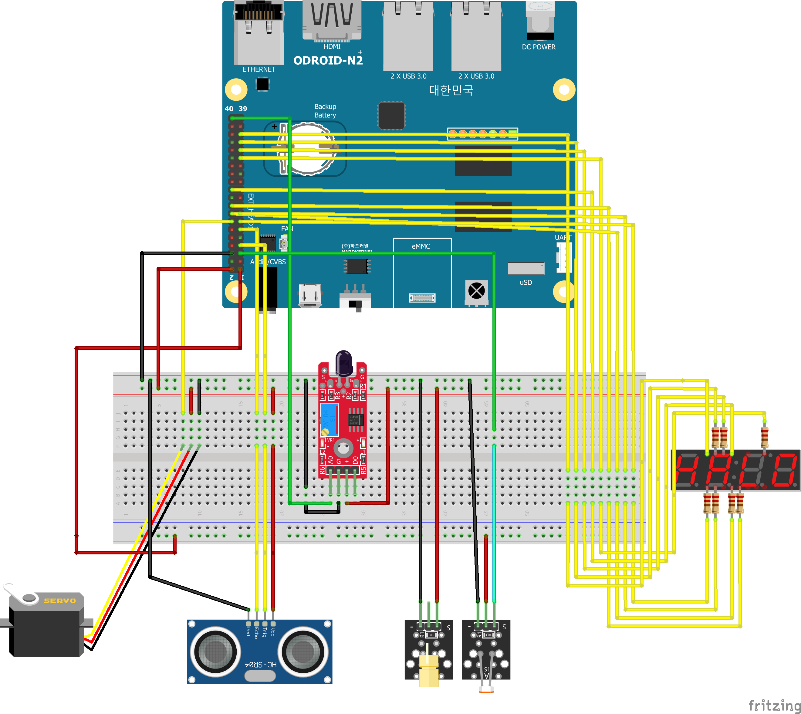
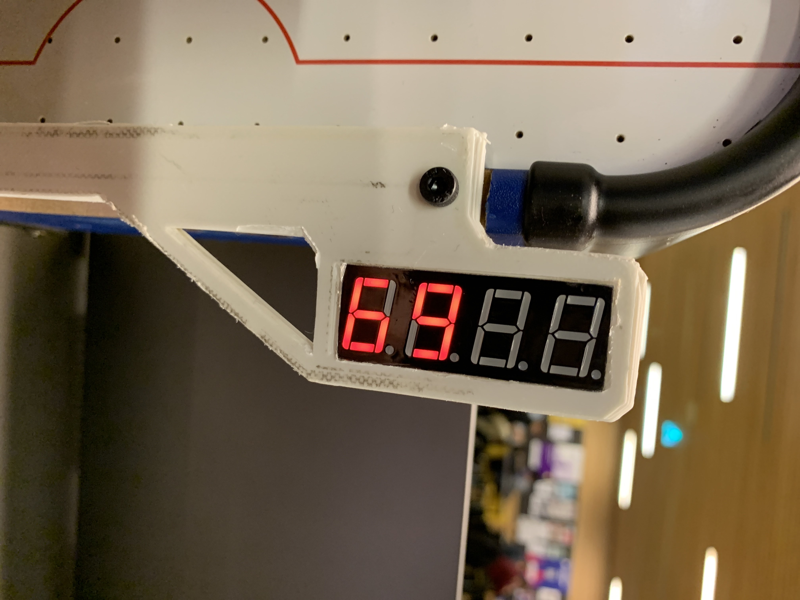

# Fasten your seatbelts


## Introductie


## Inleiding

In deze git vind je alles wat nodig is om ons idee voor een airhockey tafel na te maken. Dit project is een onderdeel van de studie Techtnische Informatica op de HVA. Dit project is gemaakt door de volgende eerste jaars TI studenten: Koen Lammers, Melvin Moes, Jayden van Oorschot, Simon Zweers, Nick schokker en Jurrien Simmons.

## Inhoudsopgave

- [Fasten your seatbelts](#fasten-your-seatbelts)
  - [Introductie](#introductie)
  - [Inleiding](#inleiding)
  - [Inhoudsopgave](#inhoudsopgave)
  - [Beschrijving](#beschrijving)
  - [Concept logo](#concept-logo)
  - [Busines Case](#busines-case)
    - [Aanleiding](#aanleiding)
    - [Verwachtingen](#verwachtingen)
    - [Oplossing](#oplossing)
    - [Voordelen](#voordelen)
  - [Benodigdheden](#benodigdheden)
  - [Beeldmateriaal](#beeldmateriaal)
  - [Installatie](#installatie)
    - [Odroid installattie](#odroid-installattie)
    - [Python en packages](#python-en-packages)
  - [Functies](#functies)
    - [Countdown](#countdown)
    - [Soundsensor](#soundsensor)
    - [Servo](#servo)
    - [LDR](#ldr)
    - [Ultrasonic](#ultrasonic)
    - [Segment display](#segment-display)
    - [Score weergave op de website](#score-weergave-op-de-website)
  - [Threading](#threading)
  - [Database](#database)
    - [Oege database](#oege-database)
    - [Database Connectie](#database-connectie)
    - [Database Query's](#database-querys)
      - [Insert Query](#insert-query)
      - [Select Query](#select-query)
  - [Terugkoppeling van de requirements](#terugkoppeling-van-de-requirements)
  - [Support](#support)
  - [Ontwikkelaars](#ontwikkelaars)
  - [Bronnen](#bronnen)

## Beschrijving

Het doel van het project is om een airhockey tafel te maken die werkt met maar 1 deelnemer. Je kan dan spelen tegen een automatische tegenstander die de puck terug zal kaatsen. De benodigdheden kan je hieronder zien. Het prototype dat gemaakt is, is een verkleinde versie van onze echte visie. Dus de lijst zal in de realiteit wel kunnen variëren.

## Concept logo

Dit was ons eerste logo Idee: een robot met een airhockey pusher op zijn hoofd. We hebben ook een naam bedacht: Rob! Dat is een afkorting van ROBot. We zijn dit logo daarna gaan uitwerken en uiteindelijk is het ons uiteindelijke logo geworden:


## Busines Case

### Aanleiding

Het idee voor dit project is om een entertainment-systeem te maken voor in de resorts en hotels van Corendon. Dit wordt een soort entertainment systeem dat mensen kunnen gebruiken op de plekken waar ze lange periodes moeten wachten (bijvoorbeeld op de bus). Dankzij dit systeem zal het wachten een stuk aangenamer worden. Op deze manier zullen deze mensen een betere ervaring beleven bij de hotels en resorts van Corendon, waardoor ze sneller het hotel zullen aanbevelen aan andere mogelijke gasten en zelf vaker terugkomen, waardoor Corendon meer winst verdient.
Een groot risico is dat het spel al snel te moeilijk of te makkelijk is. Als het spel te makkelijk is gaan mensen het saai vinden en niet vaak spelen. Als het spel te moeilijk is dan vinden mensen het ook niet leuk. Als het spel te ingewikkeld is dan zijn de gasten niet entertained. Het is dan ook te moeilijk om te begrijpen. Aan de andere kant heeft zo’n spel veel voordelen.

### Verwachtingen

Corendon heeft ons ingeschakeld om een entertainment systeem te maken voor in de lobby’s van de resorts, om de gasten te entertainen terwijl ze moeten wachten. Daaraan zijn ook een aantal eisen gesteld. We moeten in ons project minimaal 3 sensoren gaan toepassen. Ook wordt verwacht dat we een actuator gaan gebruiken om iets beweegbaar in het ontwerp te verwerken. Als laatste moet er een website komen met bijbehorende database. Vanaf de website moet het product aan te sturen zijn.

### Oplossing

Ons idee voor dit entertainment systeem is een airhockeytafel met een robot-tegenstander. Aan de ene kant van de tafel staat de speler, zoals bij normaal airhockey. Aan de andere kant staat een robotarm die het andere doel verdedigt. Het doel van het spel is om zo vaak mogelijk te scoren bij de robot in een bepaald tijdslimiet. Ons doel is om een moeilijkheidsgraad te creeeren die zowel uitdagend kan zijn voor volwassenen als voor kinderen. Verder komt er een website waarop verschillende gegevens te zien komen. Voor de gebruikers komen de huidige score en high scores op de website. Op de andere webpagina (niet voor spelers) staan andere gegevens, namelijk hoe vaak het spel gespeeld is en hoe luid het spel en omgevingsgeluid zijn.

### Voordelen

Airhockey is een heel bekend spel, iedereen weet hoe het werkt. Door een robot toe te voegen aan een airhockeytafel ontstaan er meerdere voordelen. Je kan een highscore halen en die terug zien op de website, zo kunnen spelers alsnog tegen elkaar spelen. Door de andere gegevens op de website is te zien of het spel veel gespeeld wordt en dus of het populair genoeg is. Ook is te zien of het spel nog goed werkt door een foutmelding te geven als er iets niet werkt.

## Benodigdheden

- [ ] Odroid N2+
- [ ] Servo SG90
- [ ] Afstand Sensor HC-SR04
- [ ] LDR and laser
- [ ] Sound sensor
- [ ] Segment display
- [ ] Speelgoed Airhockey tafel
- [ ] Diverse 3d geprinte onderdelen

## Beeldmateriaal

> Hieronder is een animatie te zien van hoe het product er ongeveer uit moet gaan zien.


> Hieronder is te zien hoe het prototype er in realiteit uit ziet.


> Hieronder is het aansluitschema te zien. Dit is hoe we alle onderdelen aan de Odroid hebben aangesloten.


## Installatie

### Odroid installattie

1. Flash [ubuntu minimal](https://edu.nl/hdjcd) naar een SD kaart.
2. Doe de SD kaart in de odroid en verbind de odroid met een ethernetkabel aan je laptop.
3. Gebruik in je windows terminal `arp -a` om het IP-adres te achterhalen. Het IP-adres wat je zoekt begint met `192.168.137.`. De volgende IP-adressen zijn het **NIET**:
   - IP-adressen die eindigen op .255.250 of .255
   - IP-adressen die niet beginnen met 192.168.137.
   - Mac-adressen welke bestaan uit ff-ff-ff.
4. login via ssh met het commando `ssh root@[ip adres]` waar in je `[ip adres]` vervangt door wat je hebt opgezocht in stap 3.
5. Nu willen we een statisch IP-adres toevoegen. voer het commando `nano /etc/netplan/01-netcfg.yaml` uit en voeg de onderstaande configuratie uit. **LET OP**: indents bestaan uit 2 spaties, geen tabs.

```yaml
network:
  version: 2
  renderer: networkd
  ethernets:
    eth0:
      dhcp4: no
      addresses: [192.168.137.2/24]
      nameservers:
        addresses: [8.8.8.8]
```

6. Voer het commando `netplan apply` uit.
7. Om nu de odroid te laten verbinden aan een wifi netwerk, voegen we nog een stuk configuratie aan net `.yaml` bestand. Je .yaml bestand komt er nu zo uit te zien:

```yaml
network:
  version: 2
  renderer: networkd
  ethernets:
    eth0:
      dhcp4: no
      addresses: [192.168.137.2/24]
      nameservers:
        addresses: [8.8.8.8]
  wifis:
    wlan0:
      optional: true
      access-points:
        “iotroam”:
          password: “12345678”
      dhcp4: true
```

8. Voer het commado `netplan apply` nog een keer uit

### Python en packages

1. Check eerst of je python3 hebt geinstalleerd met het commandom `python3`. Hier zie je ook de geinstalleerde versie van python. Als je geen python hebt geinstalleerd, voer je het volgende commando uit:

```bash
apt-get install python3
```

2. Installeer python pip met de volgende commando's.

```shell
apt-get install libwiringpi-dev
apt-get install odroid-wiringpi
apt-get install python3-pip
```

3. Als je de error "the following packages have unmet dependencies..." krijgt, run je het commando `apt –fix-broken install`.
4. Voer de volgende commando's uit om odroid-wiringpi te installeren

```bash
apt-get install software-properties-common
add-apt-repository ppa:hardkernel/ppa
apt-get update
apt-get install odroid-wiringpi-python
```

5. Verder moet je nog een paar pychon libraries installeren:

```python
pip install flask
pip install mysql-connector-python
```

## Functies

Om de verschillende onderdelen en sensoren aan te sturen of af te lezen hebben we voor elk onderdeel een aparte functie aangemaakt, die we later allemaal samen kunnen voegen in één bestand.

### Countdown

De eerste functie is voor het aftellen van de tijd tijdens het spelen en het printen van de timer.

```python
# Countdown for the gameloop
def countdown():
    global gameCountdown
    while gameCountdown:
        mins, secs = divmod(gameCountdown, 60)
        timer = '{:02d}:{:02d}'.format(mins, secs) 
        print(timer, end="\r")
        time.sleep(1)
        gameCountdown -= 1
        print(timer)
```

Deze functie telt af van 60, elke seconde -1. De timer wordt geprint in het formaat (minuten:seconden).

### Soundsensor

Deze functie is voor de geluidssensor/soundsensor, om het omgevingsgeluid te meten tijdens het spelen.

```python
# Function for usage of Sound Sensor
def soundsensor():
    while True:
        global sound
        # analogRead leest een float value van de sensor af (Geluid dus)
        sound = wpi.analogRead(soundSensor_PIN)
        print("Sound value:", sound)
        # Vergelijk het gelezen value met een preset value die je kan instellen bij oldSound
        if sound > thresholdSound:
            wpi.digitalWrite(LED_PIN, wpi.HIGH)
            print("Threshold Exceeded")
        else:
            wpi.digitalWrite(LED_PIN, wpi.LOW)
            print("Below Threshold")
        time.sleep(soundDelay)
```

De soundsensor geeft een waarde terug, hoe hoger de waarde hoe meer geluid hij opvangt. We blijven deze waarde om de zo veel tijd (soundDelay) opvragen en we vergelijken hem elke keer met de vooraf bepaalde grens (thresholdSound). Als het geluid boven de grens komt, gaat er een led branden.

soundSensor_PIN, thresholdSound en soundDelay zijn buiten deze functie al gedefiniëerd.

### Servo


Hierboven is te zien hoe de servo bevestigd zit in de doel constructie.

Deze functie is voor het aansturen van de servo, die de arm laat bewegen.

```python
# Function for usage of servo
def servomovement():
    global gameCountdown
    killTimer = gameCountdown
    # Start program at 90 degrees
    wpi.pwmWrite(servoPin, resetMove)
    while killTimer > 0:
            move = random.randint(int((minMove / 18) + 2) * 45, int((maxMove / 18) + 2) * 45)
            wpi.pwmWrite(servoPin, int(move))
            time.sleep(servoDelay)
            killTimer -= 0.5
    # End program on 90
    wpi.pwmWrite(servoPin, resetMove)
```

Deze functie blijft doorgaan zolang de timer uit de eerste functie nog geen 0 is. De functie berekent de variabele move, dit is een random getal tussen minMove en maxMove (die buiten de functie gedefiniëerd zijn). Zo kunnen we de servo tussen 2 hoeken laten bewegen, bijvoorbeeld 0 en 180.

Als de timer om is wordt de servo teruggezet in het midden.

### LDR


Hierboven is te zien hoe de ldr en laser ingebouwd zitten in de tafel. De laser schijnt vanuit onder het doeltje naar binnen in een klein gaatje waar aan de andere kant de ldr zich bevind. Als er dus een puck langs valt zal het signaal kort onderbroken worden.

Deze functie is voor de LDR/lichtsensor die we gebruiken om doelpunten te detecteren.

```python
# Function for usage of ldr
def ldr_func():
    global LDR_PIN
    global score
    outputOld = 0
    while True:

        output = wpi.digitalRead(9)
        print(output)

        if output < outputOld:
            score = score + 1
        outputOld = output

        time.sleep(ldrDelay)
```

Deze functie leest de waarde van de LDR op de LDR_PIN en vergelijkt deze met de vorige waarde. De LDR is een variabele weerstand, de output wordt hoger als er licht op schijnt. Door de output te vergelijken kunnen we aflezen of er wel of geen licht op schijnt, dus of de laser onderbroken wordt. Wanneer er een onderbreking gedetecteerd wordt de globale variabele `score` met 1 verhoogd. Deze word met javascript fetch vanuit de html opgelaald om de halve seconde.

Hieronder is het stukje javascript die dit regelt te zien.
```html
        <script>
            var returnValue = function () {
                fetch('/api')
                    .then((response) => response.json())
                    .then((data) => {
                        console.log(data);
                        document.getElementById("scoreID").innerHTML = data.score;
                        document.getElementById("timerID").innerHTML = data.time;
                        if (data.time <= 0) {
                            // Simulate a mouse click:
                            window.location.replace("gameover");
                        }
                    });
                
            }
            setInterval(returnValue, 500)
        </script>
```

### Ultrasonic


Hierboven is te zien hoe de ultrasound in de tafel is vastgezet. Deze sensor zit aan de spelers kant met complete zicht op zijn omgeving zodat zodra een persoon langs loopt of op de tafel zelf afloopt er een signaal gestuurd wordt naar de odroid zodat er een lampje aangaat. Hierdoor kunnen we het aantrekkelijker maken om het spel te gaan spelen.

Deze functie wordt gebruikt om Robohocky te verlichten wanneer er iemand in de buurt staat.

```python
#Kleuren
stoplichtGroen = [[0,0,10],[0,0,0],[0,0,0],[0,0,0]]
stoplichtOranje = [[0,0,0],[10,10,10],[0,0,0],[0,0,0]]
stoplichtRood = [[0,0,0],[0,0,0],[0,10,0],[0,0,0]]
stoplichtWit = [[10,10,10],[10,10,10],[10,10,10],[0,0,0]]


def distance():
    # set Trigger to HIGH
    wpi.digitalWrite(GPIO_TRIGGER, wpi.HIGH)

    # set Trigger after 0.01ms to LOW
    time.sleep(0.00001)
    wpi.digitalWrite(GPIO_TRIGGER, wpi.LOW)

    StartTime = time.time()
    StopTime = time.time()

    # save StartTime
    while wpi.digitalRead(GPIO_ECHO) == 0:
        StartTime = time.time()

    # save time of arrival
    while wpi.digitalRead(GPIO_ECHO) == 1:
        StopTime = time.time()

    # time difference between start and arrival
    TimeElapsed = StopTime - StartTime
    # multiply with the sonic speed (34300 cm/s)
    # and divide by 2, because there and back
    distance = (TimeElapsed * 34300) / 2

    if __name__ == '__main__':
        while True:
            # dist is a variable made for distance()
            dist = distance()
            # if statement that tells if distance is smaller than 100cm lights turn on
            if dist <= 100:
                ws.write2812(spi, stoplichtGroen)
                time.sleep(0.1)
                ws.write2812(spi, stoplichtOranje)
                time.sleep(0.1)
                ws.write2812(spi, stoplichtRood)
            # else statements that tells if distance is larger than 100 cm light turn off
            else:
                ws.write2812(spi, stoplichtWit)

            print("Measured Distance = %.1f cm" % dist)

    return distance

```

De ultrasonic sensor kan afstanden en bewegingen meten door pulsen van geluid uit te zenden en de tijd meten voor ze terugkomen. Door de triggerPin een kort signaal te geven wordt er een puls van geluid uitgezonden. Wanneer de echoPin een signaal ontvangt wordt de eindtijd opgeslagen. De tijd die voorbij ging is de starttijd - eindtijd. Met de geluidssnelheid (343 m/s) wordt dan de afstand berekend.

Uiteindelijk gaan de lichten branden als de afstand minder is dan onze vastgestelde grens. Zonder beweging veranderd het licht in een neutrale kleur.

### Segment display



Hierboven is de 7-segment display te zien. Deze zit aan de kant van de speler. De huidige score is er op te zien wanneer het spel bezig is.

Om het display aan te sturen is eerst een stukje setup nodig.

Het schermpje heeft 12 pins. 8 zijn voor de segmenten zelf (7 segmenten in een getal en 1 voor de punt) en de andere 4 zijn voor de 4 cijfers op het scherm. Al deze pins geven we als eerste aan en ze gaan allemaal op output:

```python
    # fysieke pins: 13, 15, (36), 16, 29, 31, 33, 35
    SEGMENT_PINS = (2, 3, 27, 4, 21, 22, 23, 24)
    # fysieke pins 18, 22, 26, 32
    DIGIT_PINS = (5, 6, 11, 26)

    # setup voor de pins van de segmenten
    for segment in SEGMENT_PINS:
        wpi.pinMode(segment, wpi.OUTPUT)
        wpi.digitalWrite(segment, 0)

    # setup voor de pins van de 4 digits
    for digit in DIGIT_PINS:
        wpi.pinMode(digit, wpi.OUTPUT)
        wpi.digitalWrite(digit, 1)
```

Vervolgens moeten we aangeven welke van de 8 segment-pins aan moeten voor de verschillende getallen, door middel van deze array:

```python
    # geeft aan welke pins aan gaan voor elk getal
    getalArray = {' ': (0, 0, 0, 0, 0, 0, 0, 0),
                  '0': (1, 1, 0, 1, 0, 1, 1, 1),
                  '1': (0, 0, 0, 1, 0, 1, 0, 0),
                  '2': (1, 1, 0, 0, 1, 1, 0, 1),
                  '3': (0, 1, 0, 1, 1, 1, 0, 1),
                  '4': (0, 0, 0, 1, 1, 1, 1, 0),
                  '5': (0, 1, 0, 1, 1, 0, 1, 1),
                  '6': (1, 1, 0, 1, 1, 0, 1, 1),
                  '7': (0, 0, 0, 1, 0, 1, 0, 1),
                  '8': (1, 1, 0, 1, 1, 1, 1, 1),
                  '9': (0, 1, 0, 1, 1, 1, 1, 1)}

```

Na alle setup kunnen we getallen laten zien op het display:

```python
while True:
    # Omdat de rechter 2 digits niet aangesloten zijn, gaat de score keer 100 zodat het 2 digits naar links komt te staan.
    getal = score * 100
    # het getal wordt omgezet in een string van lengte 4 zodat de getallen als chars opgezocht kunnen worden in de getalArray
    getalString = str(getal).rjust(4)

    # gaat langs alle 4 digits in getalString, zet de juiste segmenten aan en loopt ook door de 4 digit pins
    for digit in range(4):
        for i in range(0, 8):
            wpi.digitalWrite(SEGMENT_PINS[i], getalArray[getalString[digit]][i])
        # zet de juiste digit aan voor 0.001 seconde, zodat op elke digit een ander getal kan staan
        wpi.digitalWrite(DIGIT_PINS[digit], 0)
        time.sleep(0.001)
        wpi.digitalWrite(DIGIT_PINS[digit], 1)
```

Afhankelijk van welke digit-pin je aanzet gaat er een andere digit op het scherm branden. Door snel door ze heen te loopen (0.001 seconden) kan je op elk cijfer op het scherm iets anders laten zien, in dit geval verschillende getallen.


### Score weergave op de website

## Threading

Wij gebruiken threads in ons project om verschillende sensoren en motoren tegelijk aan te sturen/uit te lezen. Hieronder maken wij deze threads aan. De target voor deze threads zijn de hierboven beschreven [functies](#functies).

```python
# Making the threads
countdownThread = threading.Thread(target=countdown)
soundThread = threading.Thread(target=soundsensor)
servoThread = threading.Thread(target=servomovement)
ldrThread = threading.Thread(target=ldr_func)
ultraSonicThread = threading.Thread(target=ultrasonic)
insertThread = threading.Thread(target=databaseInsert)
readThread = threading.Thread(target=databaseRead)
neopixelThread = threading.Thread(target=neopixelUltra)
segmentThread = threading.Thread(target=segmentDisplay)
```

Nadat de threads zijn aangemaakt worden de threads gestart. Wat dit eigenlijk betekent is dat er aparte stukken code runnen naast de main code. Hierdoor kunnen wij meerdere codes met bijvoorbeeld verschillende delays toevoegen, wat niet mogelijk zou zijn zonder threading.

```python
# Starting the threading
if __name__ == '__main__':
    soundThread.start()
    ultraSonicThread.start()
    # ldrThread.start()
    insertThread.start()
    readThread.start()
    neopixelThread.start()
    app.run(host="0.0.0.0", port=80, debug=True)
```
Sommige threads worden aangezet doormiddel van het knopje op de website hieronder zie je hoe dit gedaan is.
```python
@app.route("/startgame", methods=["GET", "POST"])
def startgame():
    global name_user
    name_user = request.form['name']
    if ldrThread.is_alive() == False:
        ldrThread.start()
    if countdownThread.is_alive() == False:
        countdownThread.start()
    if servoThread.is_alive() == False:
        servoThread.start()
    if segmentThread.is_alive() == False:
        segmentThread.start()

    return render_template("game.html", name_user=name_user)
```
Deze threads moeten ook weer terug naar main joinen voordat er een nieuw potje begint anders krijgen we een runtime error dit doen wij op deze manier:
```python
@app.route("/gameover")
def gameover():
    ldrThread.join()
    countdownThread.join()
    servoThread.join()
    segmentThread.join()
    finalScore = score
    scoreInsert = conn.cursor()
    # scoreName = "INSERT INTO Score (name, data) VALUES (?, ?)"
    scoreInsert.execute("INSERT INTO Score (name, score) VALUES (%s, %s)", (name_user, finalScore))
    conn.commit()

    scoreRead = conn.cursor()
    scoreRead.execute("select name, score from Score ORDER BY score DESC LIMIT 10")
    test = scoreRead.fetchall()  # data from database.
    return render_template("gameover.html", test=test, name_user=name_user, score=finalScore)

```
## Database

### Oege database

Wij krijgen van school een database, die we ook voor het vak "Databases". We hebben besloten deze te gebruiken voor het opslaan van speldata zoals Naam, score etc. In het programma MySQL workbench hebben wij een schema gamaakt, wat je [hier](./assets/database/fys-db-model.mwb) kan zien.

### Database Connectie

Nadat we de mysql hebt geïnstalleerd en de database hebt aan gemaakt. Hebben we een connectie op gezet tussen onze python code en onze database, zodat we via python data kunnen insert en ophalen.

```python
import mysql.connector

conn = mysql.connector.connect(host="oege.ie.hva.nl", user="<user>", password="<password>", database="<database>")

if conn.is_connected():
    db_Info = conn.get_server_info()
    print("Connected to MySQL Server version ", db_Info)
else:
    print("Connection failed to establish")
```

<a name="database-query"></a>

### Database Query's

hieronder zal ik een paar query's laten zien die we hebben gebruikt in het project.

#### Insert Query

Met de Insert Query kunnen we dus data van de sensoren in de database zetten door middel van een variable te gebruiken in de insert query.

```python
cursor = conn.cursor()

insert = "INSERT INTO Ultrasonic (data) VALUES (%s)"
cursor.execute(insert, [dist])
conn.commit()
```

#### Select Query

Vervolgens kan je deze data weer ophalen op een pagina bijvoorbeeld met de Select Query.

```python
cursorRead = conn.cursor()
cursorRead.execute("select * from Ultrasonic ORDER BY id DESC LIMIT 20")
data = cursorRead.fetchall()  # data from database.
```

## Terugkoppeling van de requirements

De eisen van Corendon om minimaal 3 sensoren te gebruiken en een actuator in het ontwerp te verwerken worden gehaald door het gebruik van sensoren in de airhockey tafel voor het detecteren van de positie van de puck en de robotarm. De actuator zal worden gebruikt om de robotarm te besturen om de puck te verdedigen. De eis om een website met een bijbehorende database te maken zal ook worden gehaald door het aanbieden van een website waarop de huidige score en high scores zichtbaar zijn voor spelers, en waarop de beheerder op de admin pagina gegevens over de gebruiksfrequentie en geluidsniveaus kan bekijken.

## Support

Voor technische support kun je altijd support vragen bij een van onze projectdeelnemers. Zie [ontwikkelaars](#ontwikkelaars) voor contact informatie.

## Ontwikkelaars

- Koen Lammers        -   koen.lammers@hva.nl
- Melvin Moes         -   melvin.moes@hva.nl
- Jayden van Oorschot -   jayden.van.oorschot@hva.nl
- Nick Schokker       -   nick.schokker2@hva.nl
- Simon Zweers        -   simon.zweers@hva.nl
- Jurrrien Simmons    -   jurrien.simmons@hva.nl

## Bronnen

- [Database Flask bron #1](https://towardsdatascience.com/python-webserver-with-flask-and-raspberry-pi-398423cc6f5d)
- [Database Flask bron #2](https://www.instructables.com/From-Data-to-Graph-a-Web-Jorney-With-Flask-and-SQL/)
- [PHPAdmin](https://tecadmin.net/how-to-install-phpmyadmin-on-ubuntu-22-04/)
- [Html tutorial W3schools](https://www.w3schools.com/html/default.asp)
- [Css tutorial W3schools](https://www.w3schools.com/css/default.asp)
- [Flask documentatie](https://flask.palletsprojects.com/en/2.2.x/)
- [ODROID N2/N2+ documentatie](https://wiki.odroid.com/odroid-n2/odroid-n2)
- [odroid-wiringpi documentatie](https://pypi.org/project/odroid-wiringpi/)
- [Javascript fetch voorbeeld](https://developer.mozilla.org/en-US/docs/Web/API/Fetch_API/Using_Fetch)
- [HTML to python and back](https://stackoverflow.com/questions/43677564/passing-input-from-html-to-python-and-back)
- [Wiringpi](https://github.com/hardkernel/WiringPi2-Python/blob/master/README.rst)
- [HTML request forms in python](https://stackoverflow.com/questions/10434599/get-the-data-received-in-a-flask-request)
- [Seven segment display in python](https://raspi.tv/2015/how-to-drive-a-7-segment-display-directly-on-raspberry-pi-in-python)
